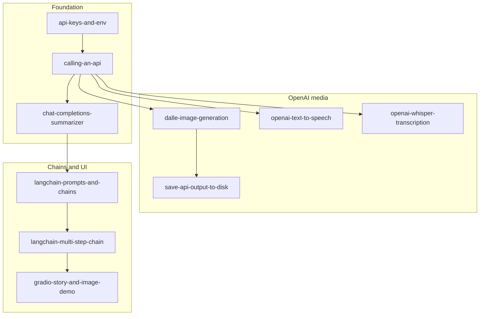

# Modular projects (from Finxter PDFs)

Each subdirectory is a **standalone learning unit**. Start with atomic modules, then capstones.

PDFs stay in the parent folder [`../`](../); these dirs are for **your code** as you work through the lessons.

## Suggested build order

### Foundation (all tracks)

1. `api-keys-and-env`
2. `calling-an-api`
3. `chat-completions-summarizer`

### OpenAI APIs (Intro track)

4. `dalle-image-generation` → `save-api-output-to-disk`
5. `openai-text-to-speech` → `openai-whisper-transcription`
6. `langchain-prompts-and-chains` → `langchain-multi-step-chain`
7. `gradio-story-and-image-demo` *(capstone)*

### Alternate providers / local

8. `ollama-local-llm`
9. `huggingface-local-image-generation`
10. `google-gemini-multimodal`

### Video track

11. `selenium-screenshot-scraper` → `openai-vision-scriptwriter`
12. Reuse `dalle-image-generation`, `openai-text-to-speech`
13. `moviepy-video-assembly` → `automated-video-pipeline` *(capstone)*

### Meme track

14. `meme-template-loader` → `chatgpt-json-meme-copy` → `pillow-meme-renderer` → `streamlit-meme-app` → `automated-meme-generator` *(capstone)*

## Shared dependencies (typical)

```text
openai, python-dotenv          # most API modules
langchain, langchain-openai    # LangChain modules
gradio                         # Gradio capstone
requests, uuid                 # download/save outputs
google-generativeai            # Gemini module
selenium, pillow               # screenshot scraper
moviepy                        # video assembly
streamlit                      # meme UI
Pillow                         # meme renderer
```

## Per-project virtual environment

Use **one `.venv` inside each module folder** so Gradio, MoviePy, Selenium, and LangChain stacks do not fight over versions.

| Step | Command | Why |
|------|---------|-----|
| 1 | `cd projects/<module-name>` | Code and secrets stay scoped to that lesson |
| 2 | `python3 -m venv .venv` | Local env; add `.venv/` to `.gitignore` |
| 3 | `source .venv/bin/activate` | Linux/macOS (Windows: `.venv\Scripts\activate`) |
| 4 | `pip install -r requirements.txt` | Install only what that module needs |
| 5 | `python <entry_script>.py` | Run the script named in the module README (or `streamlit run` / `ollama` per recipe) |

**Optional shared env:** You can create a single `projects/.venv` for quick tries, but once you mix LangChain, MoviePy, and Selenium it is easier to debug with per-project envs. Default to per-project.

---

## New project checklist

Use this whenever you open a module stub or create a sibling experiment folder. Pick a **recipe** below, then read that module’s README for the lesson goal and “Next” link.

```text
[ ] cd projects/<module-name>   # or: mkdir my-experiment && cd my-experiment
[ ] python3 -m venv .venv && source .venv/bin/activate
[ ] create requirements.txt     # see recipe for packages
[ ] pip install -r requirements.txt
[ ] create .gitignore           # at minimum: .env, .venv/, __pycache__/, output/
[ ] create .env                 # API keys only; never commit
[ ] add Python file(s) from recipe
[ ] add sample inputs (txt, mp3, png) if the lesson needs them
[ ] run entry command from recipe
```

Course-wide PDF ↔ artifact mapping: [`../INDEX.md`](../INDEX.md).

---

## Modular file kit

Finxter lessons reuse a small set of **roles**. You do not need every file in every project—add roles from the recipe you are following.

| Role | Typical files | When you need it |
|------|---------------|------------------|
| Secrets | `.env`, `.gitignore` | Any cloud API module |
| Chat client bootstrap | `chat_gpt_request.py` | Intro 1/6, summarizer, meme GPT |
| Text input | `text_to_summarize.txt` | Summarizer |
| Image generation | `generate_image.py` | DALL·E, save-to-disk, Gradio import |
| Image download helper | `download_and_save_image` in `generate_image.py` | `save-api-output-to-disk` |
| Audio output | `generate_speech.py`, `output/*.mp3` | TTS, video track |
| Audio input | `transcribe_audio.py`, `test_audio.mp3` | Whisper |
| LangChain | `langchain_basics.py` | Prompts and multi-step chains |
| UI | `gradio_project.py` or `app.py` | Gradio / Streamlit |
| Alternate provider | `simple_gemini_request.py` | Gemini (`GOOGLE_API_KEY` in `.env`) |
| Local generation | `local_image_gen.py` | Hugging Face diffusers |
| Scraper | `screenshot_page.py`, `screenshots/` | Video 1/6 |
| Vision | `vision_script.py` (+ `encode_image` helper) | Video 2/6 |
| Video assembly | `create_video.py`, `assets/images/`, `assets/audio/` | MoviePy |
| Meme data | `templates/`, `meme_data.json`, `loader.py` | Meme track start |
| Meme logic | `meme_gpt.py`, `render_meme.py` | Meme 2–3/4 |
| Capstone orchestration | `main.py` or `Meme_Gen/` tree | Video / meme capstones |

Most OpenAI scripts share this bootstrap (full chat example in [`calling-an-api/README.md`](calling-an-api/README.md)):

```python
import os
from openai import OpenAI
from dotenv import load_dotenv

load_dotenv()
CLIENT = OpenAI(api_key=os.getenv("OPENAI_API_KEY"))
```

---

## Setup recipes (by use case)

Each recipe lists: **when** → **files to create** → **`requirements.txt`** → **how to run** → **modules in this repo**.



### Recipe A — Secrets only

- **When:** First setup; no API calls yet.
- **Files:** `.env`, `.gitignore`
- **requirements.txt:** `python-dotenv`
- **Run:** `python -c "from dotenv import load_dotenv; load_dotenv(); import os; print('ok' if os.getenv('OPENAI_API_KEY') else 'missing')"`
- **Modules:** `api-keys-and-env`

Example `.env` (placeholders only):

```text
OPENAI_API_KEY=sk-your-key-here
```

Example `.gitignore`:

```text
.env
.venv/
__pycache__/
output/
```

### Recipe B — OpenAI Chat Completions

- **When:** Text in → text out via `gpt-4o-mini`.
- **Files:** Recipe A + `chat_gpt_request.py`; optional `text_to_summarize.txt` for file-based prompts.
- **requirements.txt:** `openai`, `python-dotenv`
- **Run:** `python chat_gpt_request.py`
- **Modules:** `calling-an-api`, `chat-completions-summarizer`

### Recipe C — OpenAI images and audio

- **When:** DALL·E, TTS, or Whisper (build on Recipe B client pattern).
- **Files:**
  - Images: `generate_image.py`; optional `output/` for saved PNGs
  - Save to disk: extend `generate_image.py` with download helper
  - TTS: `generate_speech.py`, `output/*.mp3`
  - Whisper: `transcribe_audio.py`, `test_audio.mp3`
- **requirements.txt:** `openai`, `python-dotenv`; add `requests` for download/save module
- **Run:** `python generate_image.py` / `generate_speech.py` / `transcribe_audio.py`
- **Modules:** `dalle-image-generation`, `save-api-output-to-disk`, `openai-text-to-speech`, `openai-whisper-transcription`

### Recipe D — LangChain

- **When:** Prompt templates, LCEL chains, invoke/stream.
- **Files:** `langchain_basics.py` (add `run_chain` logic in multi-step module).
- **requirements.txt:** `langchain`, `langchain-openai`, `python-dotenv`
- **Run:** `python langchain_basics.py`
- **Modules:** `langchain-prompts-and-chains`, `langchain-multi-step-chain`

### Recipe E — Gradio capstone

- **When:** Browser UI wiring chains + DALL·E (“Silly-o-Matic”).
- **Files:** `gradio_project.py`; import or copy `generate_image.py` from an earlier module.
- **requirements.txt:** `gradio`, `langchain`, `langchain-openai`, `openai`, `python-dotenv`
- **Run:** `python gradio_project.py` (Gradio prints a local URL)
- **Modules:** `gradio-story-and-image-demo`

### Recipe F — Google Gemini

- **When:** Gemini text or multimodal (image + text).
- **Files:** `simple_gemini_request.py`; `GOOGLE_API_KEY` in `.env`.
- **requirements.txt:** `google-generativeai`, `python-dotenv`
- **Run:** `python simple_gemini_request.py`
- **Modules:** `google-gemini-multimodal`

### Recipe G — Local models

- **When:** No cloud API for inference (Ollama CLI or Hugging Face on your machine).
- **Files:**
  - Ollama: notes or thin Python wrapper; run models via CLI
  - Hugging Face: `local_image_gen.py`
- **requirements.txt (HF):** `diffusers`, `transformers`, `accelerate` (install matching `torch` for CPU or CUDA)
- **Run:** `ollama run llama3` or `python local_image_gen.py`
- **Modules:** `ollama-local-llm`, `huggingface-local-image-generation`

### Recipe H — Browser screenshot scraper

- **When:** Full-page capture for the video track.
- **Files:** `screenshot_page.py`, `screenshots/` directory.
- **requirements.txt:** `selenium`, `pillow`, `python-dotenv` (if keys used later)
- **Run:** `python screenshot_page.py` (ensure browser/driver matches your Selenium setup)
- **Modules:** `selenium-screenshot-scraper`

### Recipe I — Vision scriptwriter

- **When:** GPT reads screenshot(s) and drafts a script.
- **Files:** `vision_script.py` (uses base64 / `encode_image` pattern); inputs from Recipe H `screenshots/`.
- **requirements.txt:** `openai`, `python-dotenv`
- **Run:** `python vision_script.py`
- **Modules:** `openai-vision-scriptwriter`

### Recipe J — Video assembly

- **When:** Combine images + audio into a final video; full automated pipeline.
- **Files:** `create_video.py`, `assets/images/`, `assets/audio/`; capstone adds `main.py` orchestrating prior steps.
- **requirements.txt:** `moviepy`, plus reuse packages from Recipes C, H, I as needed
- **Run:** `python create_video.py` or `python main.py`
- **Modules:** `moviepy-video-assembly`, `automated-video-pipeline` *(capstone)*

For the video capstone, **copy working scripts** from `dalle-image-generation`, `openai-text-to-speech`, `selenium-screenshot-scraper`, and `openai-vision-scriptwriter` instead of rewriting from scratch.

### Recipe K — Meme track (progressive)

Build in order; each step adds files on top of the last:

| Step | Module | Add |
|------|--------|-----|
| 1 | `meme-template-loader` | `templates/`, `meme_data.json`, `loader.py` |
| 2 | `chatgpt-json-meme-copy` | `meme_gpt.py` (JSON mode) |
| 3 | `pillow-meme-renderer` | `render_meme.py` |
| 4 | `streamlit-meme-app` | `app.py` |
| 5 | `automated-meme-generator` | Full `Meme_Gen/` tree *(capstone)* |

- **requirements.txt (typical):** `openai`, `python-dotenv`, `Pillow`; add `streamlit` from step 4 onward
- **Run:** `python meme_gpt.py` / `render_meme.py` during development; `streamlit run app.py` for UI
- **Modules:** all meme directories above

### Recipe L — Capstone: combine prior modules

- **When:** Intro Gradio, video pipeline, or meme app capstone.
- **How:** Follow **Suggested build order** at the top of this file; copy tested `.py` files from sibling folders into the capstone directory (or import them on `PYTHONPATH`).
- **Modules:** `gradio-story-and-image-demo`, `automated-video-pipeline`, `automated-meme-generator`

---

## Module quick reference

| Module | Recipe | Entry script / run | Extra dirs / assets |
|--------|--------|--------------------|------------------------|
| `api-keys-and-env` | A | verify with `python -c ...` | — |
| `calling-an-api` | B | `chat_gpt_request.py` | — |
| `chat-completions-summarizer` | B | `chat_gpt_request.py` | `text_to_summarize.txt` |
| `dalle-image-generation` | C | `generate_image.py` | — |
| `save-api-output-to-disk` | C | `generate_image.py` | `output/` |
| `openai-text-to-speech` | C | `generate_speech.py` | `output/*.mp3` |
| `openai-whisper-transcription` | C | `transcribe_audio.py` | `test_audio.mp3` |
| `langchain-prompts-and-chains` | D | `langchain_basics.py` | — |
| `langchain-multi-step-chain` | D | `langchain_basics.py` | — |
| `gradio-story-and-image-demo` | E | `gradio_project.py` | import `generate_image` |
| `ollama-local-llm` | G | `ollama run llama3` | notes / thin wrapper |
| `huggingface-local-image-generation` | G | `local_image_gen.py` | — |
| `google-gemini-multimodal` | F | `simple_gemini_request.py` | — |
| `selenium-screenshot-scraper` | H | `screenshot_page.py` | `screenshots/` |
| `openai-vision-scriptwriter` | I | `vision_script.py` | screenshots from H |
| `moviepy-video-assembly` | J | `create_video.py` | `assets/images/`, `assets/audio/` |
| `automated-video-pipeline` | J, L | `main.py` | combined video assets |
| `meme-template-loader` | K | `loader.py` | `templates/`, `meme_data.json` |
| `chatgpt-json-meme-copy` | K | `meme_gpt.py` | — |
| `pillow-meme-renderer` | K | `render_meme.py` | templates |
| `streamlit-meme-app` | K | `streamlit run app.py` | — |
| `automated-meme-generator` | K, L | `streamlit run app.py` | `Meme_Gen/` tree |

Per-module **Goal**, dependencies, and **Next** steps live in each subdirectory README. This file is the shared setup guide; lesson specifics stay in the child READMEs.

**Applied patterns & deployment:** modular Python reference in [`../python_cheatsheet.md`](../python_cheatsheet.md) (M01–M15: layout, APIs, Gradio/Streamlit, Docker, checklists).
